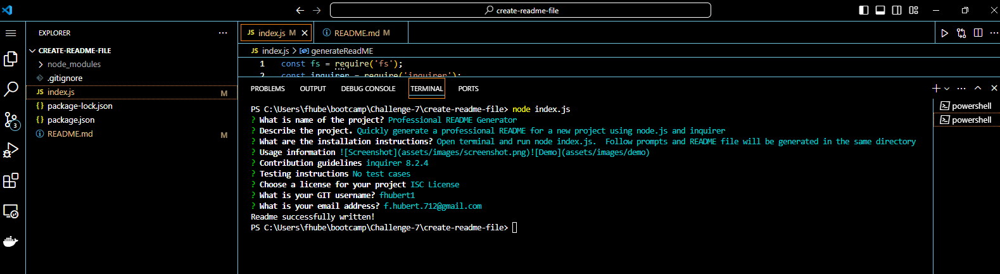

    
# Professional README Generator

## Description

Quickly generate a professional README for a new project using node.js and inquirer

## Table of Contents
   - [Installation](#installation)
   - [Usage](#usage)
   - [Credits](#credits)
   - [License](#license)
   - [Contributing](#contributing)
   - [Tests](#tests)
   - [Questions](#questions)

## Installation
Open terminal and run node index.js.  Follow prompts and README file will be generated in the same directory

## Usage
\n\n\n

## Credits
    

## License

This project is licensed under the Apache License 2.0 - see the [LICENSE](LICENSE) file for details.
 

## Contributing
Report bugs and suggestion using the email address listed below.

## Tests
No test cases

## Questions
[Contact Me](mailto:f.hubert.712@gmail.com) 

[Git](https://github.com/fhubert1)
